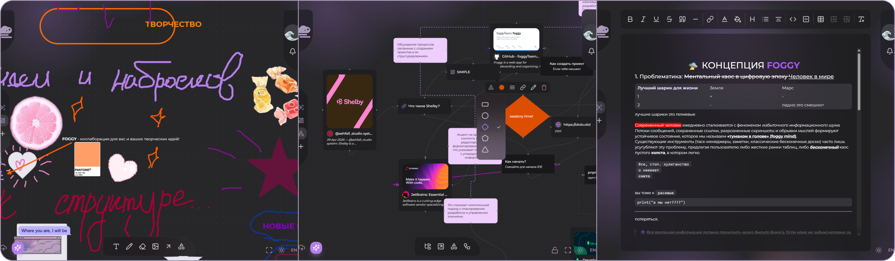
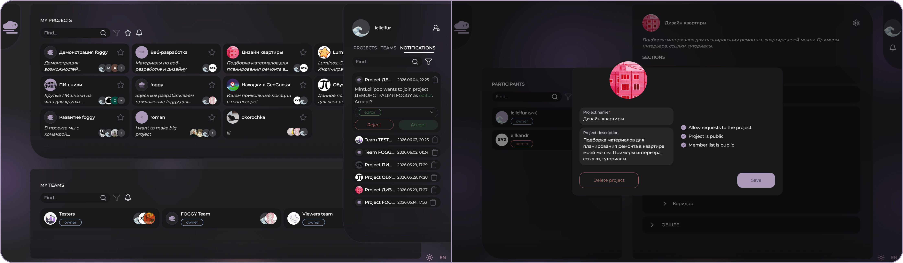
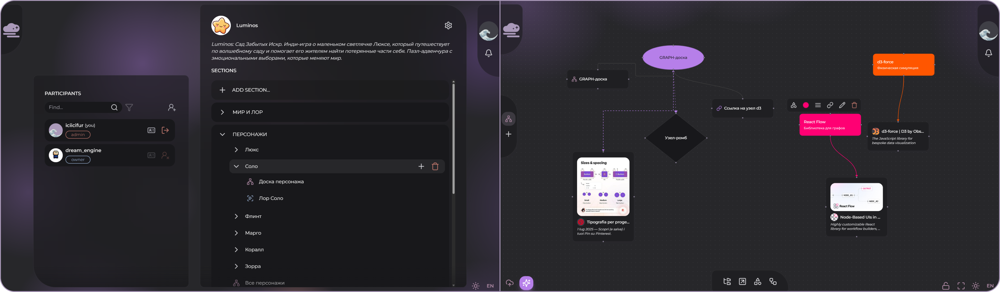
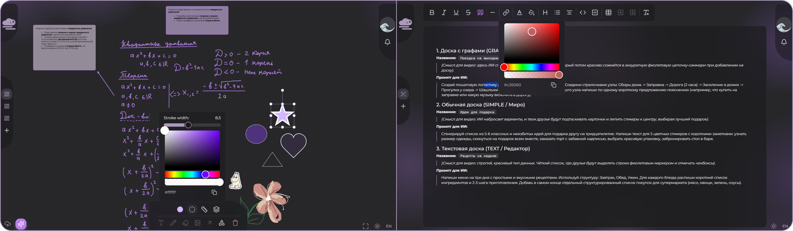
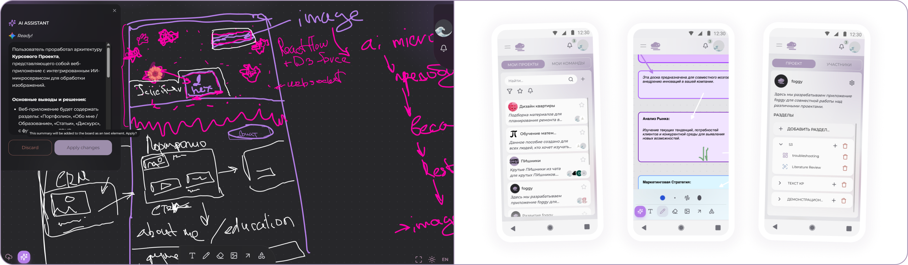

<div align='center'>
<br/>
<br/>
<a href="https://foggy.onrender.com/">

</a>
<hr/>
<h3>WHITEBOARDING & REALTIME COLLABORATION</h3>


<p>Foggy is a web-app with interactive whiteboards, graphs and text docs seamlessly integrated into one space. Collaborate to generate something creative with your team without losing any idea!</p>

<div>
<a href="https://foggy.onrender.com/"></a>
<a href="https://foggy.onrender.com/invitation/project/6a203efa04b276813dc6e914-editor-7a77badf8aa53a97edc26aab448372ad"></a>
</div>

<hr/>
</div>

# 🌫️About Project
**Foggy** is a collaborative **web application** created to address workflow fragmentation in creative projects. Today, 
brainstorming, diagramming, and documentation are often split across different tools, which increases context switching 
and _cognitive load_. Foggy integrates **interactive whiteboards**, **graph-based boards**, and **text documents** into one 
**hierarchical project space**, enabling a continuous workflow from ideation to structured materials.

This repository contains the core services of Foggy (`frontend`, `backend` and `sync service`). The project is developed as a 
Software Engineering Bachelor's diploma project.

## Demo
[](https://disk.360.yandex.ru/i/wUyXqhzgYaZ1Pg)
:arrow_up: _Click to **watch video** walkthrough._

- [Live application](https://foggy.onrender.com)
- [Demo project](https://foggy.onrender.com/invitation/project/6a203efa04b276813dc6e914-editor-7a77badf8aa53a97edc26aab448372ad) (invitation link for `editor` role)

# 🧩Architecture
Foggy is implemented as a microservice-based system with three core services:

- **frontend** - Next.js client application (UI, routing, board interaction, authentication flows);
- **backend** - NestJS REST API (business logic, data access, authorization, project/team/board management);
- **sync service** - real-time synchronization layer for collaborative board editing.

Additionally, AI-tools are powered by a separate [AI service](https://github.com/foggyTeam/aiservice).

### Interaction Model

- `frontend -> backend`: REST API for CRUD operations and metadata;
- `frontend <-> sync service`: persistent real-time channel for collaborative updates;
- `frontend -> AI service`: REST API for AI-powered features (summary and template generations);
- `backend -> database`: persistent storage and domain data management;
- `sync service -> backend`: batched boards' state updates.

## Tech Stack
<p>
  <a href="https://www.typescriptlang.org/docs/" target="_blank" rel="noreferrer">
    
  </a>
  <a href="https://nodejs.org/en/docs" target="_blank" rel="noreferrer">
    
  </a>
  <a href="https://nextjs.org/docs" target="_blank" rel="noreferrer">
    
  </a>
  <a href="https://docs.nestjs.com/" target="_blank" rel="noreferrer">
    
  </a>
  <a href="https://react.dev/" target="_blank" rel="noreferrer">
    
  </a>
  <a href="https://www.mongodb.com/docs/" target="_blank" rel="noreferrer">
    
  </a>
  <a href="https://mobx.js.org/README.html" target="_blank" rel="noreferrer">
    
  </a>
  <a href="https://tailwindcss.com/docs" target="_blank" rel="noreferrer">
    
  </a>
  <a href="https://www.heroui.com/docs" target="_blank" rel="noreferrer">
    
  </a>
  <a href="https://playwright.dev/docs/intro" target="_blank" rel="noreferrer">
    
  </a>
</p>

As the project is a web-application, it is primarily built with **TypeScript** across all core services.  
Frontend is implemented with Next.js/React, while backend is implemented with NestJS and MongoDB.  
State management and UI consistency are handled with MobX, Tailwind CSS, and HeroUI; end-to-end quality checks are covered by Playwright.

## Repository Structure

```text
foggy/
├─ frontend/      # Next.js client application
├─ backend/       # NestJS API
├─ sync_service/  # real-time synchronization service for collaborative editing
├─ e2e/           # Playwright tests for end-to-end quality checks and benchmarking
├─ docs/          # media assets for README
└─ ...            # root configs (pnpm workspace, linting, CI, etc.)
```

# ⚙️Local Setup

### Start Project

- [install MongoDB client](https://www.mongodb.com/try/download/community);
- install Node.js `v20.14.0` or higher;
- prefer package manager `pnpm`: `npm install -g pnpm` _(installs it globally)_;
- run:

  `pnpm install`;

  `pnpm dev` to run the project in development mode;

  `pnpm start` to run the project in production mode.

### Dependencies
Project uses four workspaces for dependencies management:
- `package.json` - global:

  *includes dev-dependencies, lock-file and manages three local workspaces;*
- `backend/package.json` - backend:

  *includes both dev and production backend dependencies;*
- `sync_service/package.json` - sync service:

  *includes both dev and production sync service dependencies;*
- `frontend/package.json` - frontend:

  *includes both dev and production frontend dependencies; linked to root file `.npmrc`, which installs
  HeroUI in root `node_modules`.*

Workspaces are managed by `pnpm-workspaces.yaml`, and lock-file `pnpm-lock.yaml` contains full information
about dependencies for each workspace.

### Flow Model
Project uses GitFlow model:
- `develop` - the latest actual project version;
- `master` - the latest deployed project version;
- `FOGGY-n` - feature branches originated from `develop`;
- `hotfix-<title>` - commits straight into `master` with hotfixes;
- `release v<major_v>.<minor_v>.<hotfix_n>` - PR (releases) from `develop` to `master`.

# 🚀Deployment

## Render

We deploy [api](https://foggy-backend.onrender.com/api), [frontend](https://foggy.onrender.com) and [sync service](https://foggy-sync.onrender.com) on [Render](https://render.com).

**Note:** app re-deploy triggers on any file changes in `master`; in case changes
are minor and re-deploy is unnecessary, commit message may contain `[skip render]`.

## Docker
Docker uses other environment variables than development/production.
This is required for correct connection of the backend container to the database container; when containers are
started, `NODE_ENV` changes to `production` (in `docker-compose.yml` file), and the environment variable `MONGO_URI` changes according to the database address in Docker and is used by the backend to connect to the database when `NODE_ENV='production'`.


**Note:** since environment changes to `production`, dev-dependencies will not work in containers.

### Environment Variables

All environment variables can be changed except for `FRONTEND_PORT`, which should be changed in other ways.

# 👥Team
Foggy is developed by a student team as a Software Engineering Bachelor diploma project.
- **Olesya Dobrovolskaya** — Frontend / Sync Service Developer  
  GitHub: [@IciIcifur](https://github.com/IciIcifur)

- **Maria Petrova** — Backend Developer  
  GitHub: [@MINTCanella](https://github.com/MINTCanella)

- **Maxim Karkulevskiy** — AI Service  
  GitHub: [@Karkulevskiy](https://github.com/Karkulevskiy)

---
# 🧾Supplementary
## Screenshots




## Other Materials

**Thesis Defense Presentation:** [Figma Slides](https://www.figma.com/deck/484G0J3bzjhCoQ8FFDJ6RL/foggy-2026?node-id=1-42&viewport=-105%2C-5%2C0.5&t=gptyQQDLy3bxkLoz-1&scaling=min-zoom&content-scaling=fixed&page-id=0%3A1)

**Frontend Thesis text:** [Google Docs](https://docs.google.com/document/d/1KY_uTO6j9pB8e-yBGq36t8MDCylygk1uO5H4n36H7aI/edit?usp=sharing)